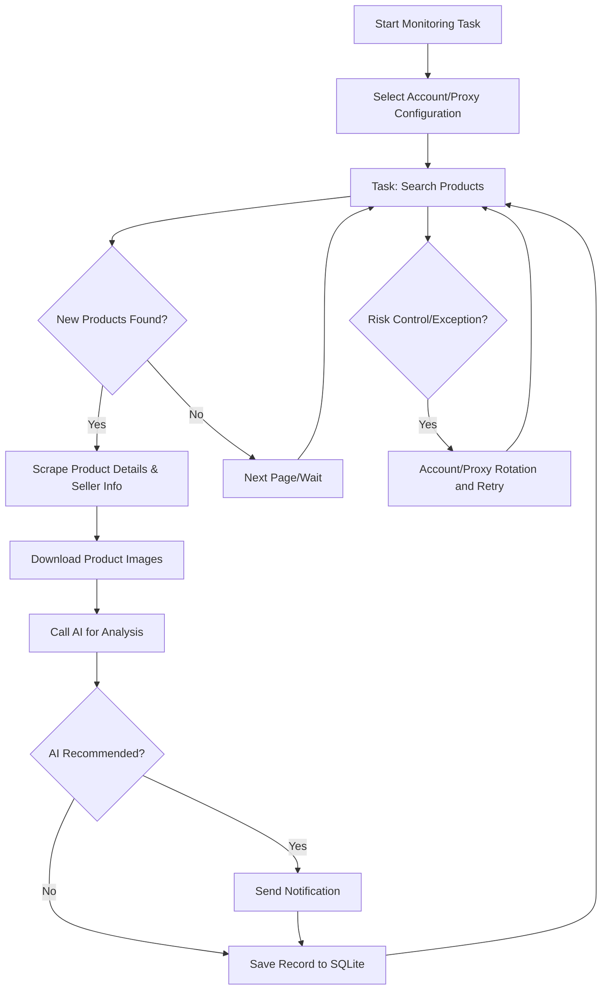

# Goofish Intelligent Monitor Bot

[English README](README_EN.md)

A Playwright and AI-powered multi-task real-time monitoring tool for Goofish (Xianyu), with a complete web management interface.

## Core Features

- **Web Visual Management**: Task management, account management, AI criteria editing, run logs, results browsing
- **AI-Driven**: Natural language task creation, multimodal model for in-depth product analysis
- **Multi-Task Concurrency**: Independent configuration for keywords, prices, filters, and AI prompts
- **Advanced Filtering**: Free shipping, new listing time range, province/city/district three-level region filtering
- **Instant Notifications**: Supports ntfy.sh, WeChat Work, Bark, Telegram, Webhook
- **Scheduled Tasks**: Cron expression configuration for periodic tasks
- **Account & Proxy Rotation**: Multi-account management, task-account binding, proxy pool rotation with failure retry
- **Docker Deployment**: One-click containerized deployment

## Screenshots


## Docker Deployment (Recommended)

```bash
git clone https://github.com/Usagi-org/ai-goofish-monitor && cd ai-goofish-monitor
cp .env.example .env
vim .env # fill in the required configuration values
docker compose up -d
docker compose logs -f app
docker compose down
```

If the image is inaccessible or downloads slowly, try using a mirror:
```bash

docker pull ghcr.nju.edu.cn/usagi-org/ai-goofish:latest
docker tag ghcr.nju.edu.cn/usagi-org/ai-goofish:latest ghcr.io/usagi-org/ai-goofish:latest
docker compose up -d

```

- Default Web UI address: `http://127.0.0.1:8000`
- The Docker image includes Chromium; no extra browser installation is needed on the host.
- Official image: `ghcr.io/usagi-org/ai-goofish:latest`
- Update image: `docker compose pull && docker compose up -d`
- If you change `SERVER_PORT` in `.env`, update the port mapping in `docker-compose.yaml` as well.
- `docker-compose.yaml` mounts the primary SQLite database directory as `./data:/app/data`; the default database file is `data/app.sqlite3`
- These paths are persisted by default:
    - `data/`  Primary SQLite store (tasks, results, price history)
    - `state/`  Login-state cookie files
    - `prompts/`  Task prompt files
    - `logs/`  Runtime logs
    - `images/`  Product images and per-task temporary image folders
    - `config.json`, `jsonl/`, `price_history/`  Legacy data sources used for the one-time SQLite migration

### Storage and Migration

- SQLite is the current online primary store, default path `data/app.sqlite3`
- You can override the database path with the `APP_DATABASE_FILE` environment variable; Docker sets it to `/app/data/app.sqlite3`
- On startup the app initializes the schema and attempts a one-time import from legacy `config.json`, `jsonl/`, and `price_history/`
- `state/`, `prompts/`, `logs/`, and `images/` remain filesystem directories and are not stored in SQLite
- Product images are temporarily downloaded to `images/task_images_<task_name>/` and are cleaned up by default when the task finishes
- After the first upgrade, once you confirm the data in `data/app.sqlite3` is correct, you can decide whether to keep the legacy `config.json`, `jsonl/`, and `price_history/` mounts depending on your deployment

### Minimum Configuration

| Variable | Description | Required |
|------|------|------|
| `OPENAI_API_KEY` | AI model API key | Yes |
| `OPENAI_BASE_URL` | OpenAI-compatible API base URL | Yes |
| `OPENAI_MODEL_NAME` | Model name with image input support | Yes |
| `WEB_USERNAME` / `WEB_PASSWORD` | Web UI login credentials, default `admin/admin123` | No |

See “Configuration” below for the rest.


### First-Time Setup

1. Open the default Web UI at `http://127.0.0.1:8000` and sign in.
2. Go to “Goofish Account Management” and use the [Chrome Extension](https://chromewebstore.google.com/detail/xianyu-login-state-extrac/eidlpfjiodpigmfcahkmlenhppfklcoa) to export and paste the Goofish login-state JSON.
3. Login-state files are saved to the `state/` directory, for example `state/acc_1.json`.
4. Go back to “Task Management”, create a task, bind an account, and run it.

### Create Your First Task

- `AI mode`: fill in the detailed requirements and submit. A separate progress dialog opens while the analysis criteria are generated asynchronously in the background.
- `Keyword mode`: provide keyword rules and the task is created immediately, without the AI generation step.
- `Region filter`: now uses a province / city / district three-level selector backed by an embedded Goofish page snapshot.


## User Guide

<details>
<summary>Click to expand Web UI usage notes</summary>

### Task Management

- Supports AI creation, keyword rules, price range, new listing range, region filters, account binding, and cron scheduling.
- AI task creation runs as a background job and shows a dedicated progress dialog after submission.
- Region filtering can greatly reduce results; leaving it empty is the safer default.

### Account Management

- Import, update, and delete Goofish account login states.
- Each task can bind a specific account or leave account selection to the system.

### Results and Run Logs

- The results page and export functionality now query SQLite instead of directly scanning `jsonl` files.
- The logs page shows the run history per task, making it easy to diagnose login-state expiry, anti-bot triggers, and AI call issues.

### System Settings

- View system status, edit prompts, and adjust proxy and rotation-related configuration.

</details>


## Developer Guide

### Requirements

- Python 3.10+
- Node.js + npm (locally verified with `Node v20.18.3` for the frontend build)
- Playwright CLI and Chromium; before the first run execute `python3 -m pip install playwright && python3 -m playwright install chromium`
- Chrome or Edge browser (Linux environments can also use Chromium; `start.sh` checks for a browser before proceeding)

```bash
git clone https://github.com/Usagi-org/ai-goofish-monitor
cd ai-goofish-monitor
cp .env.example .env
```

### One-Click Start

```bash
chmod +x start.sh
./start.sh
```

`start.sh` first checks the Playwright CLI and browser prerequisites; once they are satisfied it installs project dependencies, builds the frontend, copies the artifacts, and starts the backend.

### Manual Start

```bash
# backend
python -m src.app
# or
uvicorn src.app:app --host 0.0.0.0 --port 8000 --reload

# frontend
cd web-ui
npm install
npm run dev
```

- FastAPI initializes SQLite on startup and performs the one-time legacy import from `config.json/jsonl/price_history` on the first launch
- `spider_v2.py` reads tasks from SQLite by default; JSON config is only used when `--config <path>` is passed explicitly
- Default database path is `data/app.sqlite3`
- The Vite dev server proxies `/api`, `/auth`, and `/ws` to `http://127.0.0.1:8000`.
- `npm run build` outputs to `web-ui/dist/`; `start.sh` copies this to the repository root `dist/`.
- FastAPI serves `dist/index.html` and `dist/assets/` from the repository root.
- `./start.sh` prints the default access URL `http://localhost:8000` and API docs `http://localhost:8000/docs`.

### Testing and Validation

```bash
PYTEST_DISABLE_PLUGIN_AUTOLOAD=1 pytest
cd web-ui && npm run build
```

### Task Creation API

<details>
<summary>Click to expand API behavior notes</summary>

- `POST /api/tasks/generate`
  - `decision_mode=ai`: returns `202` and a `job`; the client should poll for progress.
  - `decision_mode=keyword`: returns the created task directly.
- `GET /api/tasks/generate-jobs/{job_id}`: query AI task generation progress.
- `POST /auth/status`: validate Web UI login credentials.

</details>

## Configuration

<details>
<summary>Click to expand common configuration items</summary>

### AI and Runtime

- `OPENAI_API_KEY` / `OPENAI_BASE_URL` / `OPENAI_MODEL_NAME`: required AI model settings.
- `PROXY_URL`: dedicated HTTP/SOCKS5 proxy for AI requests.
- `RUN_HEADLESS`: whether to run the scraper in headless mode; keep it `true` in Docker.
- `SERVER_PORT`: backend listening port, default `8000`.
- `LOGIN_IS_EDGE`: switch to Edge locally; Docker images do not bundle Edge and always use Chromium.
- `PCURL_TO_MOBILE`: convert desktop product URLs to mobile URLs.

### Notifications

- `NTFY_TOPIC_URL`
- `GOTIFY_URL` / `GOTIFY_TOKEN`
- `BARK_URL`
- `WX_BOT_URL`
- `TELEGRAM_BOT_TOKEN` / `TELEGRAM_CHAT_ID` / `TELEGRAM_API_BASE_URL`
- `WEBHOOK_*`

### Proxy Rotation and Failure Guard

- `PROXY_ROTATION_ENABLED`
- `PROXY_ROTATION_MODE`
- `PROXY_POOL`
- `PROXY_ROTATION_RETRY_LIMIT`
- `PROXY_BLACKLIST_TTL`
- `TASK_FAILURE_THRESHOLD`
- `TASK_FAILURE_PAUSE_SECONDS`
- `TASK_FAILURE_GUARD_PATH`

See `.env.example` for the full list.

</details>

## Web Authentication

<details>
<summary>Click to expand authentication notes</summary>

- The Web UI uses a login page and validates credentials through `POST /auth/status`.
- After login, the frontend stores local auth state for route guards and WebSocket initialization.
- Default credentials are `admin/admin123`; change them in production.

</details>

## Workflow

The diagram below shows the core processing flow of a single monitoring task from start to finish. The main service runs in `src.app` and launches one or more task processes based on user actions or scheduled triggers.



## FAQ

<details>
<summary>Click to expand FAQ</summary>

### Why does AI task creation not complete immediately?

In AI mode, the system first generates analysis criteria and then creates the task. This flow has been changed to a background job, so after submitting you will see a separate progress dialog instead of a blocked form.

### Why is the region filter recommended to be left empty by default?

Region filtering significantly reduces the result set; it is best suited for cases where you specifically want to see listings from a particular area. If you are evaluating the broader market, leave it empty first.

### Why does the local page say frontend build artifacts are missing?

This means the root `dist/` directory is missing. Run `./start.sh` directly, or first run `npm run build` inside `web-ui/` and confirm the artifacts have been copied to the repository root.

### Why does `./start.sh` report missing Playwright or browser?

This is the script's prerequisite check. Install the Playwright CLI and Chromium first, make sure Chrome / Edge (or Chromium on Linux) is available on the system, and then re-run `./start.sh`.

</details>


## Acknowledgments

<details>
<summary>Click to expand acknowledgments</summary>

This project referenced the following excellent projects during development. Special thanks to:

- [superboyyy/xianyu_spider](https://github.com/superboyyy/xianyu_spider)

Also thanks to LinuxDo contributors for their script contributions:

- [@jooooody](https://linux.do/u/jooooody/summary)

And thanks to the [LinuxDo](https://linux.do/) community.

And thanks to ClaudeCode/Gemini/Codex and other model tools for freeing our hands and letting us experience the joy of Vibe Coding.

</details>


## Notices

<details>
<summary>Click to expand notice details</summary>

- Please comply with Goofish's user agreement and robots.txt rules. Do not make overly frequent requests to avoid burdening the server or having your account restricted.
- This project is for learning and technical research purposes only. Do not use it for illegal purposes.
- This project is released under the [MIT License](LICENSE), provided "as is" without any form of warranty.
- The project authors and contributors are not responsible for any direct, indirect, incidental, or special damages or losses caused by the use of this software.
- For more details, please refer to the [Disclaimer](DISCLAIMER.md) file.

</details>

## Star History

[](https://www.star-history.com/#Usagi-org/ai-goofish-monitor&Date)


